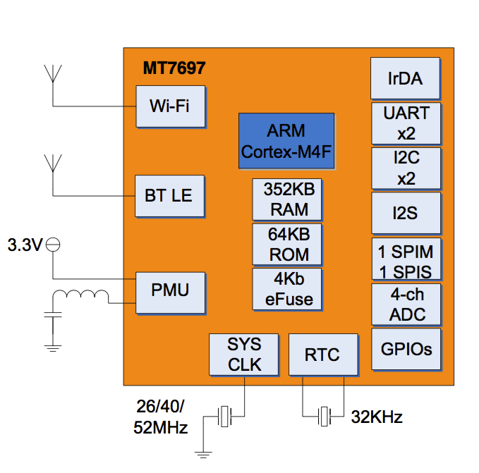
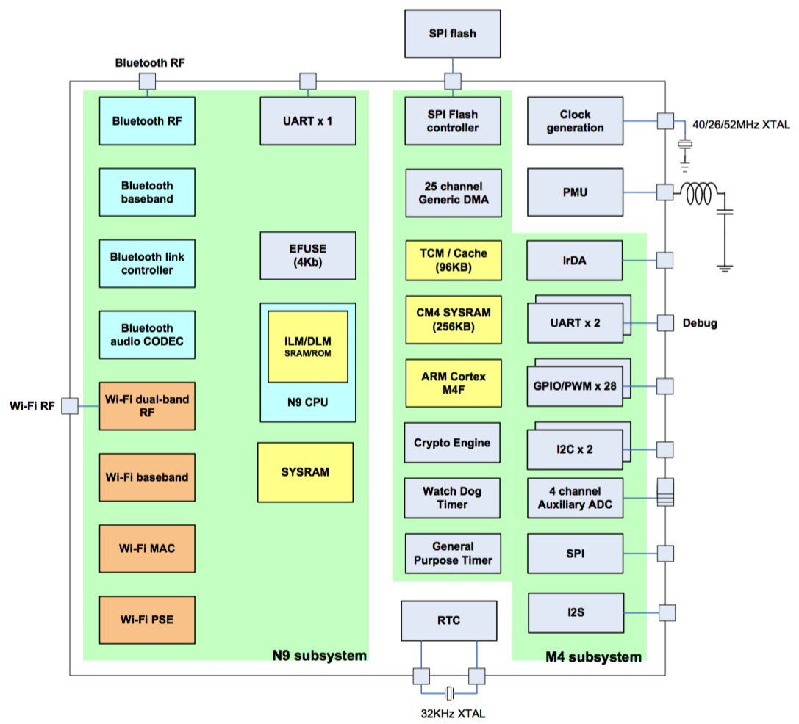
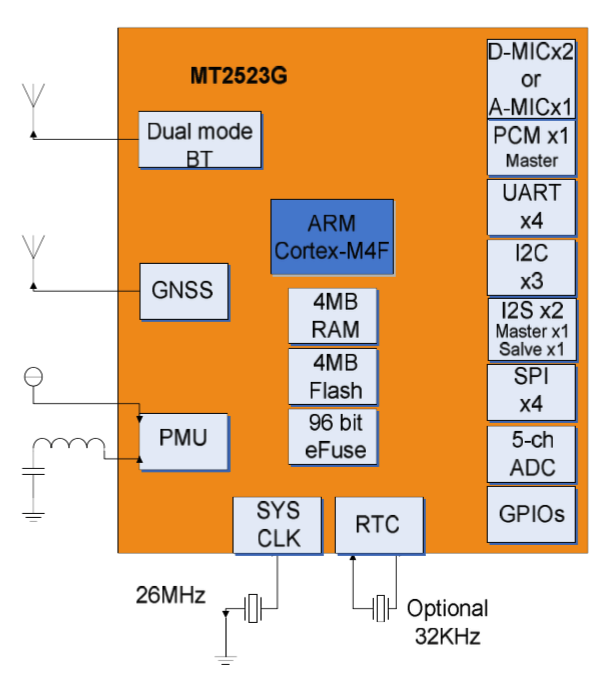
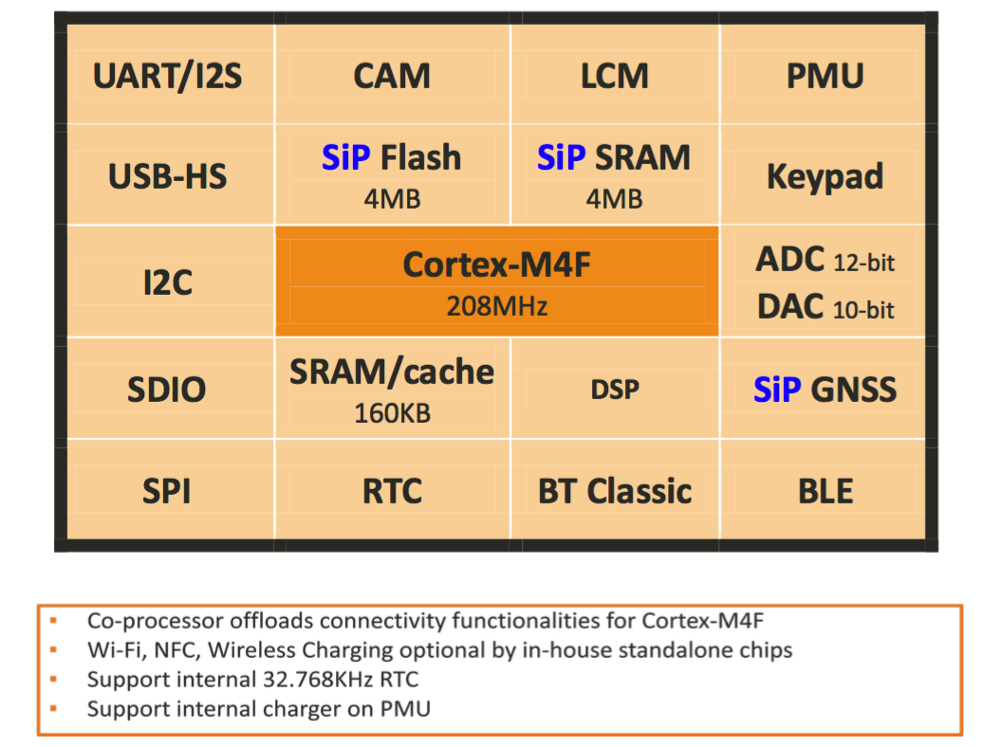

# MTK LinkIt Platform

## MT7697

## MT2523

## MT7687/97 vs MT2523

SoC/SiP                                                                                            | MT7687/97                                                                             | MT2523
---                                                                                                | ---                                                                                   | ---
Platform                                                                                           |                                                                                       |
                                                                                                   | ARM Cortex M4 MCU with FPU                                                            | ARM Cortex M4 with floating point MCU with FPU.
                                                                                                   | Embedded 352KB SRAM and 64KB bootROM                                                  | Embedded 4MB + 160KB SRAM and 4MB flash.
                                                                                                   | Supports external serial flash with Quad Peripheral Interface (QPI) mode              |
                                                                                                   | Supports eXecute In Place (XIP) on flash                                              |
                                                                                                   | 32KB cache in XIP mode                                                                |
                                                                                                   | 25 DMA channels                                                                       | 25 DMA channels.
                                                                                                   | Low power RTC mode with 32KHz crystal support                                         | Low power RTC mode with 32 kHz crystal support.
                                                                                                   |                                                                                       | Dual mode BT/BLE, large TX power and excellent RX sensitivity, to support the best coverage.
                                                                                                   |                                                                                       | Supports high battery voltage (4.8v) to extend the battery life.
                                                                                                   |                                                                                       | Multiple frequency and voltage modes for low power and computing power balance: High speed (1.3v, 208MHz), Full speed (1.1v, 104MHz), Low speed (0.9v, 26MHz).
                                                                                                   |                                                                                       | Low power crystal oscillator clock sources down to 40μA.
                                                                                                   |                                                                                       |
Connectivity                                                                                       |                                                                                       |
                                                                                                   | SPI, UART, I2C, I2S, PWM, ADC, IrDA, GPIO                                             | UART, I2C, SPI, I2S, PWM, SDIO, MSDC, USB, PCMIF, ADC, dual digital MIC.
                                                                                                   |                                                                                       |
GNSS                                                                                               |                                                                                       | (2523G only)
                                                                                                   |                                                                                       | GPS/GLONASS/GALILEO/BEIDOU
                                                                                                   |                                                                                       | Supports multi-GNSS including QZSS, SBAS ranging.
                                                                                                   |                                                                                       | Supports WAAS/EGNOS/MSAS/GAGAN.
                                                                                                   |                                                                                       | 12 multi-tone active interference cancellers (ISSCC2011 award).
                                                                                                   |                                                                                       | RTCM ready.
                                                                                                   |                                                                                       | Indoor and outdoor multi-path detection and compensation.
                                                                                                   |                                                                                       | Supports FCC E911 compliance and A-GPS.
                                                                                                   |                                                                                       | Maximum fixed update rate up to 10 Hz.
																							       |                                                                                       |
WLAN                                                                                               |                                                                                       |
                                                                                                   | IEEE 802.11 b/g/n compliant                                                           |
                                                                                                   | Dedicated high-performance 32-bit RISC CPU                                            |
                                                                                                   | Supports 20MHz, 40MHz bandwidth in 2.4GHz band                                        |
                                                                                                   | Single-band 1T1R mode with data rate up to 150Mbps                                    |
                                                                                                   | Supports STBC, LDPC                                                                   |
                                                                                                   | Greenfield, mixed mode, legacy modes support                                          |
                                                                                                   | IEEE 802.11 d/e/h/i/k/r/w support                                                     |
                                                                                                   | Security support for WFA personal, WPS2.0, WAPI                                       |
                                                                                                   | Supports 802.11w protected frames WPA/WPA2 managed                                    |
                                                                                                   | QoS support of WFA WMM, WMM PS                                                        |
                                                                                                   | Integrated LNA, PA, and T/R switch                                                    |
                                                                                                   | Optional external LNA and PA support.                                                 |
                                                                                                   | RX diversity support with additional RX input                                         |
                                                                                                   |                                                                                       |
Bluetooth                                                                                          |                                                                                       |
                                                                                                   | Bluetooth specification 2.1+EDR                                                       | Bluetooth specification 2.1+EDR.
                                                                                                   | Bluetooth 4.2 Low Energy (LE)                                                         | Bluetooth 4.2 Low Energy (LE).
                                                                                                   | Integrated BALUN and PA                                                               | Integrated BALUN and PA.
                                                                                                   | Scatternet support: Up to 7 piconets simultaneously with background inquiry/page scan | Scatternet support: Up to 7 piconets simultaneously with background inquiry/page scan.
                                                                                                   | Up to 7 simultaneous active ACL links                                                 | Up to 7 simultaneous active ACL links.
                                                                                                   | Supports SCO and eSCO link with re-transmission                                       | Supports SCO and eSCO links with re-transmission.
                                                                                                   | Support wide-band speech and hardware accelerated SBC codec for A2DP streaming        |
                                                                                                   | Packet loss concealment                                                               |
                                                                                                   | Channel quality driven data rate adaptation                                           | Channel quality driven data rate adaptation.
                                                                                                   | Channel assessment for AFH                                                            | Channel assessment for AFH.
                                                                                                   |                                                                                       |
Display                                                                                            |                                                                                       |
                                                                                                   |                                                                                       | DBI interface: Simultaneous connection to 2 serial LCD modules and maximum resolution up to 320 x 320.
                                                                                                   |                                                                                       | DSI interface: Supports command modes, ultra-low power mode and maximum resolution up to 480x320(HVGA), 30fps.
